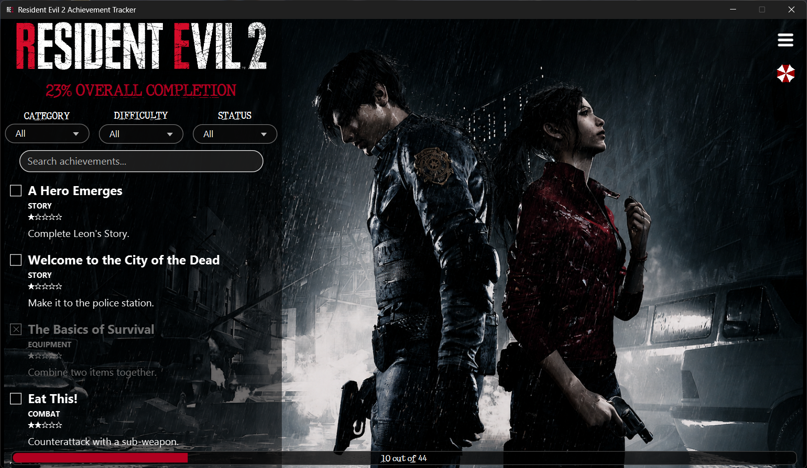
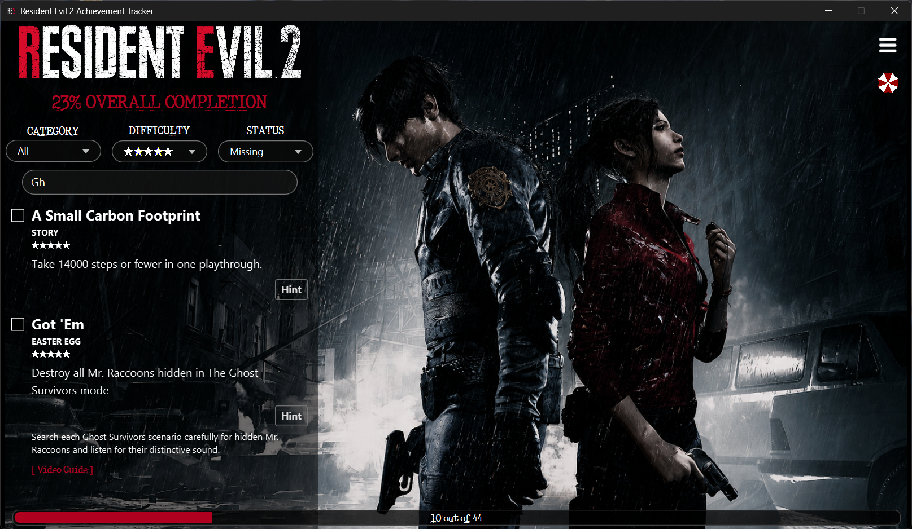
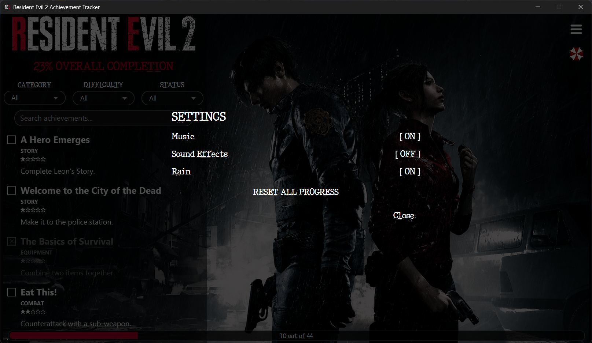
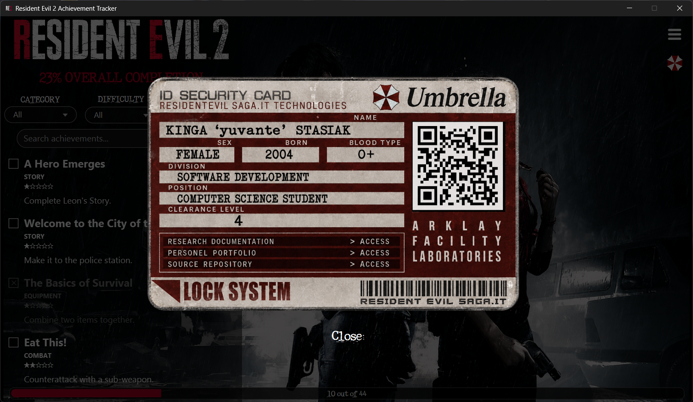

# Resident Evil 2 Achievement Tracker

A desktop achievement tracking application for Resident Evil 2 Remake,
built with Java, JavaFX and SQLite.

Track all 44 achievements, filter and search through them, access hints and
video guides, and keep your completion progress saved between sessions.

## Features

- Checklist containing all 44 achievements from Resident Evil 2 Remake
- Persistent progress tracking, completed achievements are saved between sessions
- Search achievements by name
- Filter achievements by category, difficulty and completion status
- Optional hints and external video guide links for individual achievements
- Overall completion tracker with a progress bar and achievement counter
- Background music, rain ambience and sound effects with individual on/off controls
- Option to reset all achievement progress
- RE2-inspired, easy-to-navigate user interface

## Screenshots

### Search, Filters & Hints

### Settings

### About Me

## Installation

1. Download the latest Windows installer from the [Releases](https://github.com/yuvante/RE2-achievement-tracker/releases) page.
2. Run `RE2 Achievement Tracker-1.0.0.exe`.
3. Follow the installation wizard.
4. Launch the application from the desktop shortcut or Start Menu.

> **Windows Security Notice:** The application is currently unsigned.
> Windows SmartScreen or Smart App Control may display a warning or prevent
> the application from launching.

## Technologies

- **Java** — application logic
- **JavaFX** — graphical user interface
- **SQLite** — achievement data and progress persistence
- **CSS** — interface styling
- **JDBC** — communication between Java and SQLite
- **jpackage** — Windows application packaging
- **WiX Toolset** — Windows installer creation

## How It Works

The application uses an SQLite database containing all 44 achievements together
with their descriptions, categories, difficulty levels, hints and links to
external video guides.

The JavaFX interface loads achievement data from the database and dynamically
displays it in the achievement list. Achievements can be searched and filtered
by category, difficulty and completion status.

Completion progress is stored in the SQLite database, allowing checked
achievements and the overall progress counter to persist between application
sessions. The database is bundled with the application and, on first launch,
is copied to the user's local application data directory, where progress can
be updated without modifying the original bundled database.

The application also includes optional background music, rain ambience and
sound effects, which can be controlled independently through the settings menu.

## Development

My opus primum, made purely for educational purposes because I wanted to play
around with designing GUI applications. This was my first independent Java
desktop project, built after completing my first year of Computer Science.

The project gave me a chance to work with JavaFX for the first time, since I had
previously only used Swing, and connect a GUI application to an SQLite database.
During development, I implemented achievement filtering and searching, persistent
progress tracking, audio controls, hints and external guide links. I also learned
how to package a Java application as a standalone Windows application and create
an installer using jpackage and WiX.

I documented the development process day by day in Notion, including the initial
database design, implementation process, UI changes, problems I ran into and the
final packaging of the application.

You can read the full development diary [here](https://app.notion.com/p/PROJECT-Achievement-Tracker-3b3d434ac90480ccbe2ee13db35f312b?source=copy_link).


## Disclaimer

This is an unofficial, non-commercial fan-made project created for educational
and portfolio purposes. It is not affiliated with, endorsed by, sponsored by,
or otherwise associated with Capcom.

Resident Evil, Resident Evil 2, and all related names, characters, logos,
images, audio, and other intellectual property are trademarks and/or
copyrighted works of Capcom Co., Ltd. and their respective owners.

Any Resident Evil 2 assets used in this project are used solely for the purpose
of demonstrating the functionality and visual design of this fan-made
application. No ownership of these assets is claimed.

This project is distributed free of charge and is not intended for commercial
use.